# Inventory Management System
A full-featured inventory management system developed as a Final Year Project (FYP).

---

## Overview
The Inventory Management System is designed to help manage and monitor stock efficiently. It provides features for user authentication, item tracking, reporting, and notifications, all within a centralized dashboard.

This project was developed as part of my Final Year Project to demonstrate skills in system development, UI/UX design, and data management.

---

## Features
- User Authentication (Login & Reset Password)
- Dashboard with system overview
- Item tracking and inventory management
- Report generation
- User profile management
- Notification system
- User-friendly interface

---

## Screenshots
- Login & Reset Password Page
  
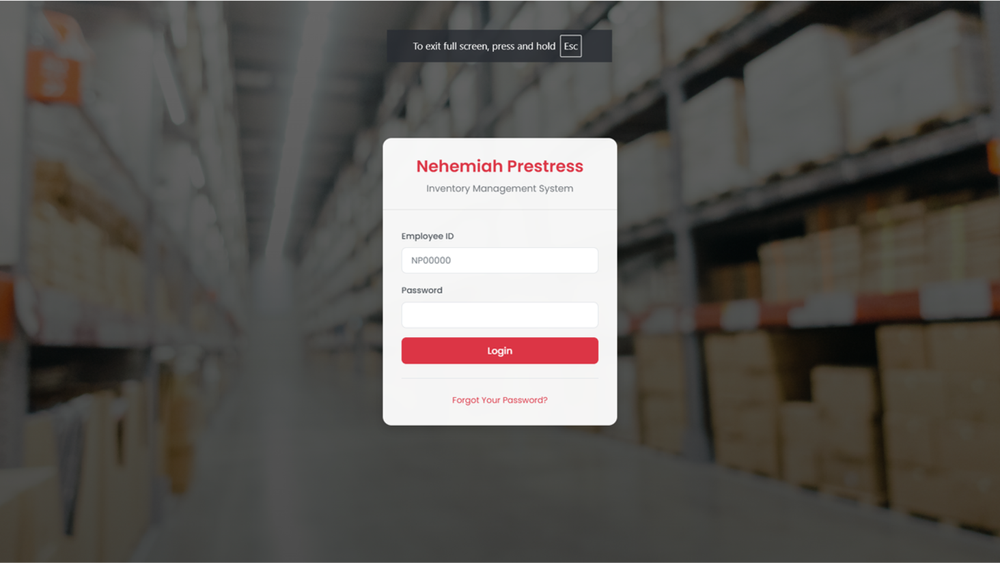

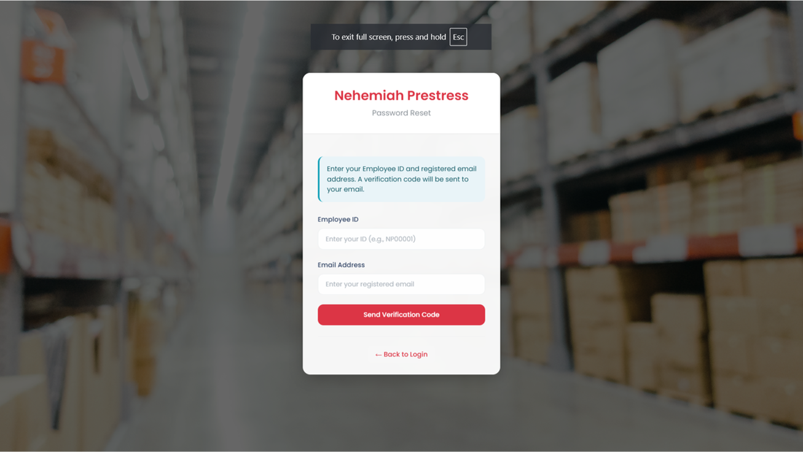

- Dashboard Page
  
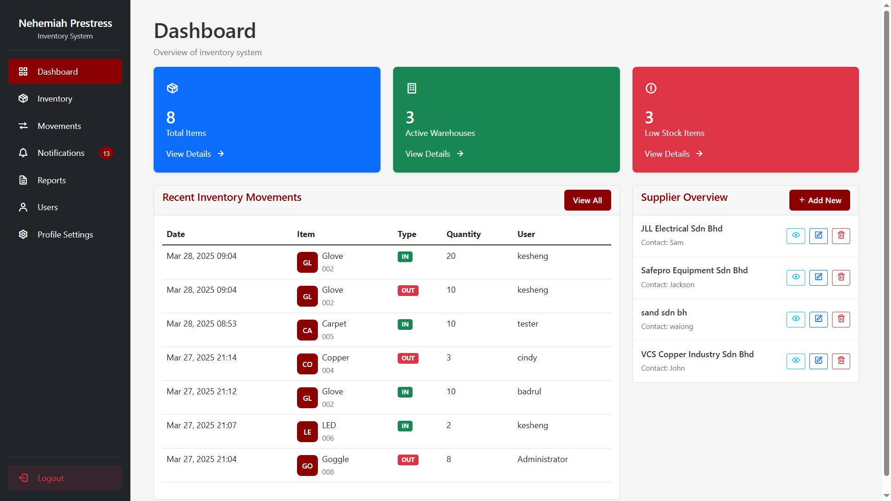

- Warehouse Management Page
  
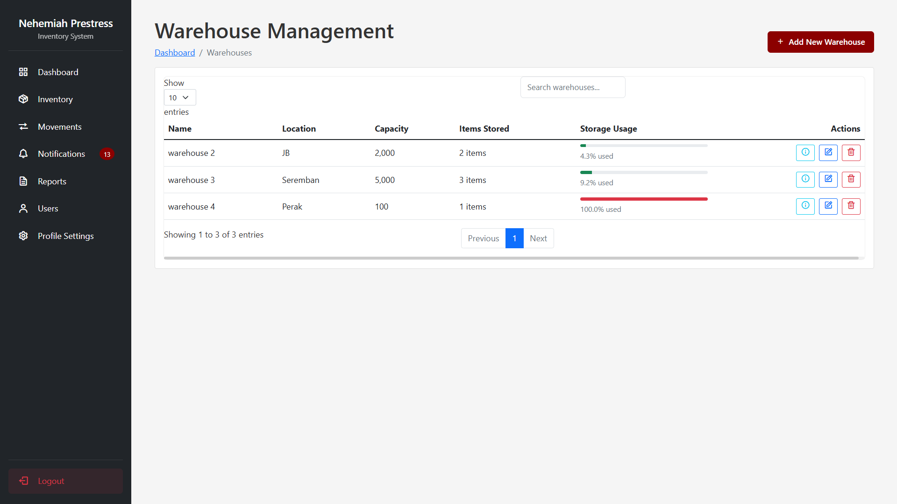

- Warehouse Details Page
  
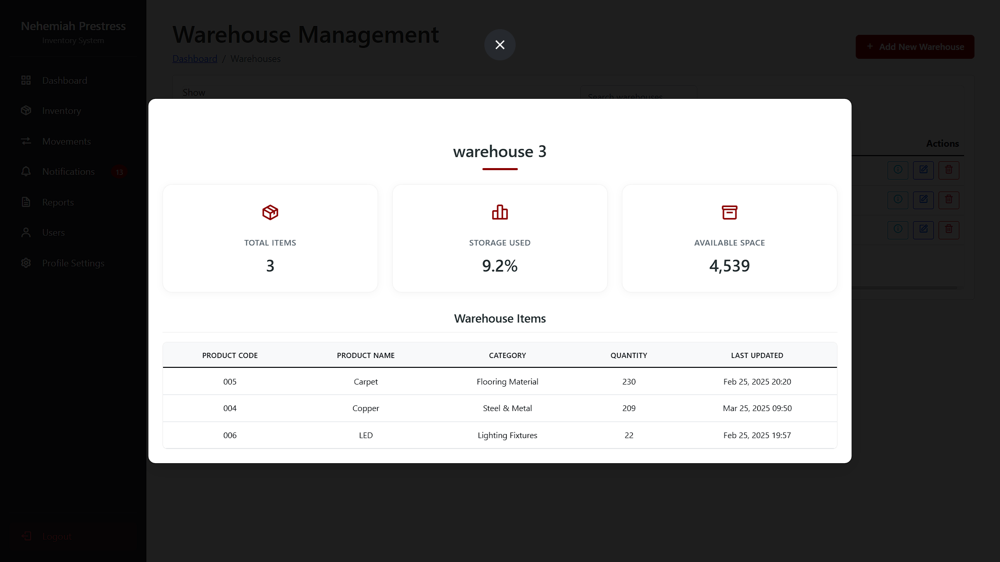

- Inventory Page
  
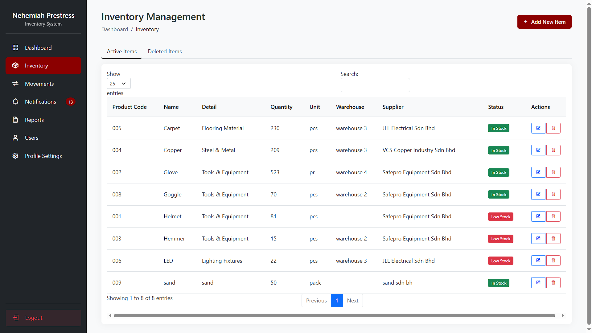

- Inventory Tracking Page
  
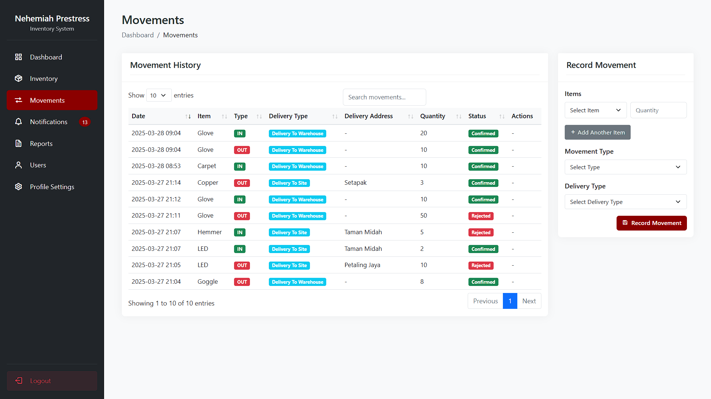

- Notification Page
  
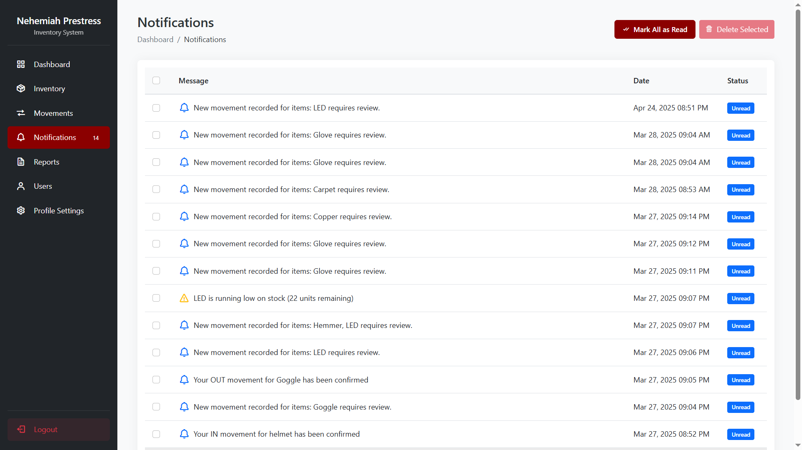

- Report Generator Page
  
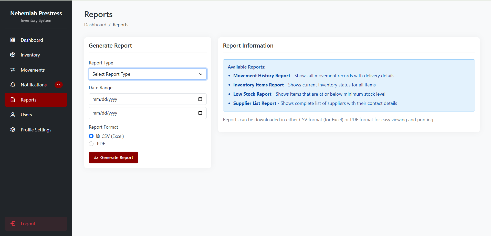

- User Management Page
  
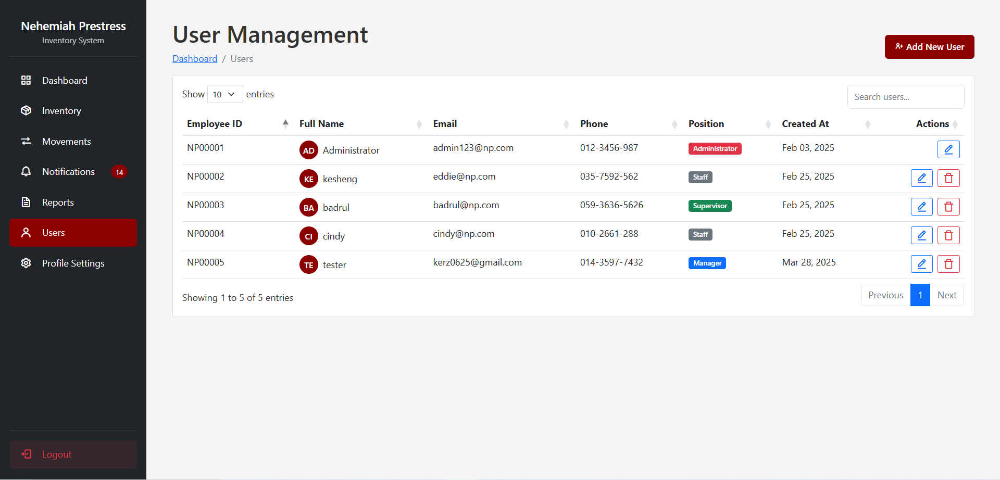

- Profile Settings Page
  
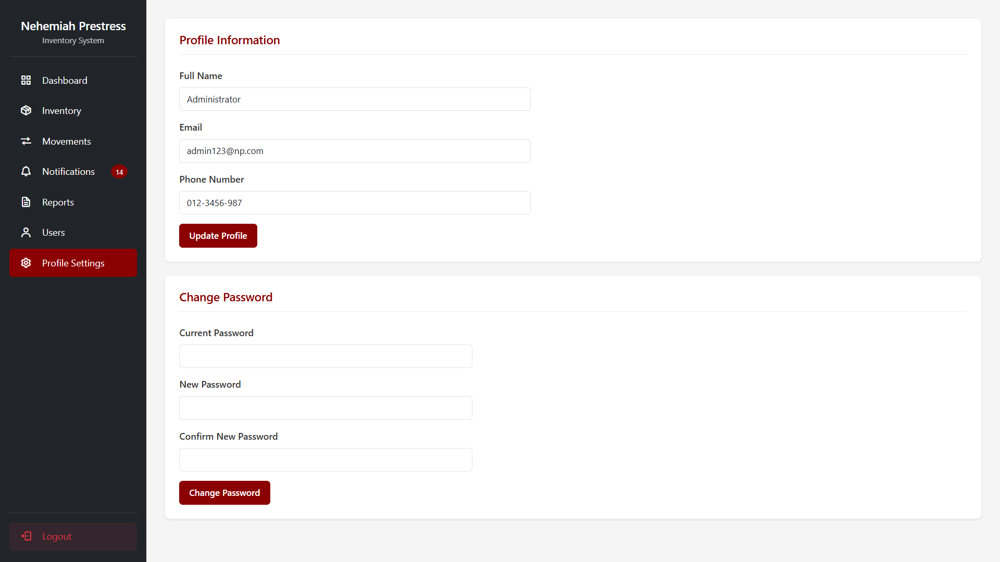

---
